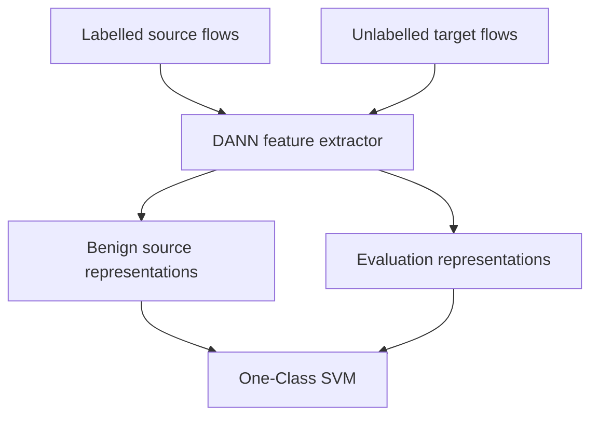

# DI-NIDS

Research code for **DI-NIDS: Domain Invariant Network Intrusion Detection System**.

DI-NIDS addresses cross-domain degradation in machine-learning-based network intrusion
detection. It uses a Domain-Adversarial Neural Network (DANN) to project NetFlow records into a
domain-invariant representation, then trains a One-Class SVM (OSVM) on benign source-domain
representations. Target labels are not passed to either training loss. For compatibility with the
original experiments, the legacy mode uses target `Attack` metadata only to stratify its held-out
split and later uses target labels for evaluation.

> **Reproducibility status:** this repository provides the reference implementation and supplied
> checkpoints. The complete experiments from the paper have not yet been rerun in the packaged
> environment. Read the [reproducibility notes](docs/REPRODUCIBILITY.md) before comparing new
> outputs with the published tables.

## Paper

Siamak Layeghy, Mahsa Baktashmotlagh, and Marius Portmann, "DI-NIDS: Domain invariant network
intrusion detection system", *Knowledge-Based Systems*, vol. 273, article 110626, 2023.

- [Published article](https://doi.org/10.1016/j.knosys.2023.110626)
- [Open-access preprint](https://arxiv.org/abs/2210.08252)

If this repository supports your work, please cite the paper using the entry in
[`CITATION.cff`](CITATION.cff) or the BibTeX entry below.

```bibtex
@article{layeghy2023dinids,
  title   = {DI-NIDS: Domain Invariant Network Intrusion Detection System},
  author  = {Layeghy, Siamak and Baktashmotlagh, Mahsa and Portmann, Marius},
  journal = {Knowledge-Based Systems},
  volume  = {273},
  pages   = {110626},
  year    = {2023},
  doi     = {10.1016/j.knosys.2023.110626}
}
```

## Method

The implementation follows four stages:

1. Remove the four flow identifiers from the 43 NetFlow-v2 fields, leaving 39 model inputs.
2. Train the source label classifier and DANN using labelled source flows and unlabelled target
   flows.
3. Project flows through the trained ten-dimensional DANN feature extractor.
4. Fit an OSVM on benign source representations, then evaluate it on source or target flows.



The model classes retain the checkpoint-compatible layer layout. Its exact structure and the
relationship to the high-level architecture in Table 1 of the paper are documented in the
[reproducibility notes](docs/REPRODUCIBILITY.md#implemented-architecture).

## Repository layout

```text
DI-NIDS/
├── src/dinids/                   Installable implementation and command-line interface
├── models/original_checkpoints/  Supplied DANN encoders and source classifiers
├── tests/                        Unit and smoke tests
├── docs/REPRODUCIBILITY.md       Methodological and comparison notes
├── CITATION.cff                  Citation metadata
├── pyproject.toml                Package and dependency metadata
└── requirements.txt              Convenience dependency list
```

## Installation

Python 3.10 or later is required. A CUDA-capable GPU is strongly recommended for full DANN
training, although CPU and Apple MPS execution are supported.

```bash
python3 -m venv .venv
source .venv/bin/activate
python -m pip install --upgrade pip
python -m pip install -e .
```

For a development installation:

```bash
python -m pip install -e ".[dev]"
pytest
ruff check src tests
```

If the default PyTorch package is unsuitable for your CUDA version, install the appropriate
PyTorch build first, following the [official PyTorch instructions](https://pytorch.org/get-started/locally/),
and then install this project.

## Data

The paper uses the NetFlow-v2 versions of two benchmark datasets:

- [NF-CSE-CIC-IDS2018-v2](https://espace.library.uq.edu.au/view/UQ:e9636b7)
- [NF-UNSW-NB15-v2](https://espace.library.uq.edu.au/view/UQ:ffbb0c1)

The broader collection is available from the
[UQ ML-Based NIDS Datasets page](https://staff.itee.uq.edu.au/marius/NIDS_datasets/).
Dataset files are not redistributed in this repository. Follow the terms attached to each
dataset record.

Supported input formats are CSV, compressed CSV, and Parquet. Legacy pandas pickle files are
also supported, but only when `--allow-unsafe-pickle` is supplied. Never enable that flag for an
untrusted file because pickle deserialisation can execute code.

Every input must contain the 43 NetFlow-v2 fields plus `Attack` and binary `Label` columns. The
label convention is:

| Value | Meaning |
| ---: | --- |
| `0` | Benign flow |
| `1` | Attack flow |

## Quick evaluation with supplied encoders

The supplied encoder must match the source direction. The first command uses CIC-2018 as the
source and UNSW-NB15 as the target:

```bash
dinids evaluate \
  --source data/NF-CSE-CIC-IDS2018-v2.csv \
  --target data/NF-UNSW-NB15-v2.csv \
  --source-name NF-CSE-CIC-IDS2018-v2 \
  --target-name NF-UNSW-NB15-v2 \
  --encoder models/original_checkpoints/encoder_source_cic2018.pt \
  --output results/cic2018_to_unsw_nb15.json
```

Reverse the domains and select the UNSW-NB15 source encoder for the opposite direction:

```bash
dinids evaluate \
  --source data/NF-UNSW-NB15-v2.csv \
  --target data/NF-CSE-CIC-IDS2018-v2.csv \
  --source-name NF-UNSW-NB15-v2 \
  --target-name NF-CSE-CIC-IDS2018-v2 \
  --encoder models/original_checkpoints/encoder_source_unsw_nb15.pt \
  --output results/unsw_nb15_to_cic2018.json
```

Omit `--encoder` to run the raw-feature OSVM baseline:

```bash
dinids evaluate \
  --source data/NF-CSE-CIC-IDS2018-v2.csv \
  --target data/NF-UNSW-NB15-v2.csv \
  --output results/osvm_cic2018_to_unsw_nb15.json
```

Kernel OSVM fitting can become prohibitively expensive with hundreds of thousands of benign
flows. `--max-benign-train-rows N` provides a deterministic source-training cap for exploratory
runs. A capped run is a changed experiment, so always report the value and do not compare it
directly with an uncapped paper result.

Evaluation JSON reports attack-positive and benign-positive precision, recall, and F1 separately,
along with macro-F1, accuracy, attack ROC-AUC, and an explicitly named confusion matrix. This
avoids the positive-class ambiguity in the original script.

## Training a new DANN

```bash
dinids train-dann \
  --source data/NF-CSE-CIC-IDS2018-v2.csv \
  --target data/NF-UNSW-NB15-v2.csv \
  --source-epochs 10 \
  --dann-epochs 10 \
  --batch-size 1024 \
  --device cuda \
  --output-dir runs/cic2018_to_unsw_nb15
```

Training writes separate source-only and DANN checkpoints, including the discriminator, plus a
JSON training summary.

The compatibility defaults retain a fixed batch order and the original constant DANN learning
rate. Use `--shuffle-batches` and `--optimisation scheduled` for a conventional shuffled,
scheduled training run, and report these changes as a new experiment.

For a quick smoke run, use `--max-source-rows` and `--max-target-rows`. Such a run is useful for
testing the installation, not for reproducing the paper.

## Preprocessing modes

Two modes are explicit because preprocessing materially affects cross-domain results.

| Mode | Behaviour | Intended use |
| --- | --- | --- |
| `legacy-independent` | Fits a separate min-max scaler on each complete domain before splitting | Compatibility with the supplied implementation and checkpoints |
| `source-train` | Fits one scaler on the source training split and applies it everywhere | New method development with cleaner holdout discipline |

`legacy-independent` is the default for reproducibility. It is transductive and uses feature
ranges from complete source and target datasets. Report the selected mode with every result.
The supplied encoders were created with the legacy behaviour and should not be assumed compatible
with `source-train` scaling.

## Supplied checkpoints

| Source domain | Encoder | Source classifier |
| --- | --- | --- |
| NF-CSE-CIC-IDS2018-v2 | `encoder_source_cic2018.pt` | `classifier_source_cic2018.pt` |
| NF-UNSW-NB15-v2 | `encoder_source_unsw_nb15.pt` | `classifier_source_unsw_nb15.pt` |

The files are original PyTorch state dictionaries renamed for clarity. Their SHA-256 hashes are
in [`models/SHA256SUMS`](models/SHA256SUMS). The loader uses PyTorch's `weights_only=True` mode.
The original archive did not include trained domain-classifier checkpoints.

## Reproducibility limits

- Exact dataset snapshots, the original execution environment, and random-fold records are not
  distributed with this repository.
- The paper's complete numerical results have not yet been regenerated from this packaged release.
- Some implementation details are more specific than the high-level description in the paper.
  These details are documented for transparent comparison.
- OSVM training can be expensive on millions of benign flows. Full experiments require substantial
  memory and compute.

See [docs/REPRODUCIBILITY.md](docs/REPRODUCIBILITY.md) for the settings that should accompany
reported results.

## Security and intended use

This is research software, not a production intrusion-prevention system. It does not capture live
traffic, block connections, or provide operational response controls. Validate any model on traffic
representative of the intended network and account for false positives, false negatives, drift,
and adversarial manipulation. See [SECURITY.md](SECURITY.md).

## Licence

An open-source licence has not yet been selected. Until a licence file is added, standard copyright
restrictions apply. The repository owner should choose a licence before announcing the release.
